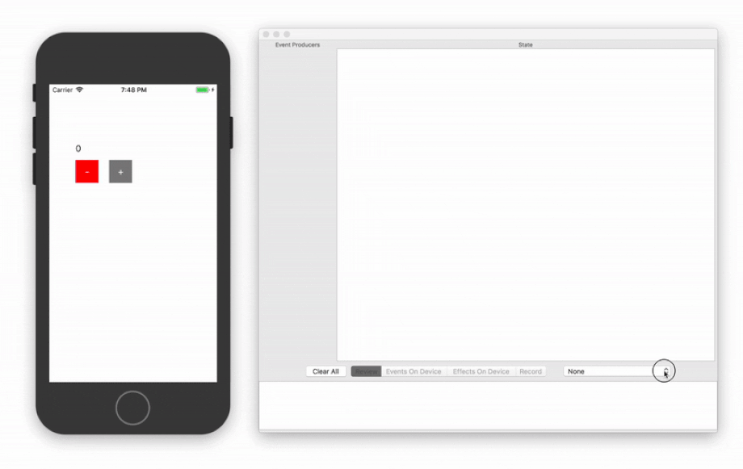
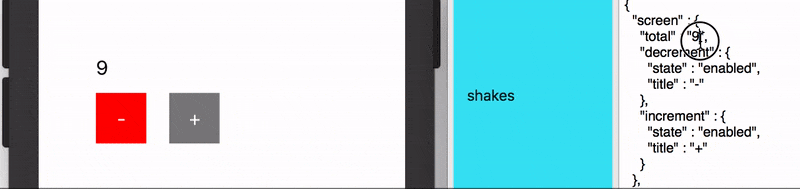

# CycleMonitor

A macOS application for monitoring/editing the state of an application over MultipeerConnectivity. 

## Reasoning

The visibility and dependability of state can be mysterious. Other mediums enjoy the ability of being quickly manipulated and viewed across a temporal spectrum with applications like [Final Cut](https://www.apple.com/final-cut-pro/) and [Logic](https://www.apple.com/logic-pro/). What would an application like those look like for code? CycleMonitor is an exploration of that idea. It was written with the intent of being paired with applications written using [Cycle.swift](https://github.com/BrianSemiglia/Cycle.swift/) but is not exclusive to them.

## Features
- Recording of events and their resulting state (even while disconnected from monitor)
- Playback of states back to device
- Playback of events back to device
- Saving/opening of sessions
- Generation of tests from selected states in timeline
- Editing of states via text editor (can be played-back to device as text is entered)

## Example
Includes a sample app. To use:
1. Run `pod install`
2. Boot up the monitor and sample app
3. Hit the Record tab
4. Select the intended client from the drop-down
5. Produce events from the iOS application (button-pressing, backgrounding of app, etc.)

The sample app also keeps a running total of the last 25 `Moments` to allow for later review should you experience something worth review while offline. To retrieve that timeline:
1. Produce events from the iOS application (button-pressing, backgrounding of app, etc.)
2. Shake the device
3. Send the report to yourself
4. Open the report using `CycleMonitor`

## State
### Type
CycleMonitor records state as `Moment`s over time with a schema of:

    struct Moment {
      var drivers: [Driver]
      var cause: Driver
      var effect: String
      var context: String
      var isApproved = false
      
      struct Driver { // Drivers are event producers
        var label: String
        var action: String
        var id: String
      }
    }

Each `Moment` provides its cause/effect as well as a list of the drivers/event-producers that were being recorded at the time. The moment's active driver/event-producer indicates itself as the cause by providing a non-nil `action`. An `Moment`'s context/effect can be conveniently be created using the reflective abilities of `Wrap` (`func wrap<T>(_ object: T) -> [String: Any]?`).
   
### Broadcast
As events are experienced on the client, they can be encoded as `Moment`s, converted to JSON and broadcasted to the monitor. `MultipeerJSON` is provided as a convenience to make those broadcasts and is designed to consume a type of `RxSwift.Observable<[AnyHashable: Any]>`. `MultipeerJSON` buffers outgoing transmissions until a connection is established. `MultipeerJSON` also provides an  `RxSwift.Observable<[AnyHashable: Any]>` of responses should you choose to send state back to the device via the _Effects On Device_ feature.

    let moment = CycleMonitor.Moment(...)
    let JSON = moment.coerced() as [AnyHashable: Any]
    let transmitter = MultipeerJSON()
    let responses: RxSwift.Observable<[AnyHashable: Any]> = transmitter.rendered(
      RxSwift.Observable.just(JSON)
    )

### Consumption
If your application is designed to consume a single source-of-truth/state, it has the potential to disregard its version of that state and instead consume a new state injected remotely. `CycleMonitor` can send states to a client in order to review their rendering. Converting the incoming JSON into your application's `State` is not as easy as the inverse and requires traditional JSON serialization.

### Validation
Once the `effect` of a `cause` on a `context` is considered to be correct, that `Moment` can be serialized and further tested as development continues. To save `Moment`s, select their checkbox in the timeline and then select `File > Export Tests`. Those files can then be imported into the client's Xcode project and tested. The sample app uses this single (pseudo code) function for all `Moment`s:

    // 1. deserialize all `.moment` files into the application's `Moment` types
    // 2. assert that each `Moment`'s `cause` applied to its `context` produces its `effect`
    
This approach only tests the business-logic/state-manipulation portion of the application, not the rendering of the resulting state.

## Potential Improvements

Debuggers usually allow inspection through a 3-dimensional perspective of time, temporarily displaying values as they change. CycleMonitor attempts a 4-dimensional view, where all values are presented at once and can be inspected at will. However, a timeline has the potential to fork in many ways and its presentation could be improved with an additional perspective. 

If a 4th-dimension provides all values as a timeline, a 5th-dimension would provide all possible timelines as a tree. This would be a lot of information to present and a challenge to visualize comprehensively. Visualization would provide a means of user-evaluation but if that evaulation was automated, visualization might not be necessary. Evaluation could be automated if a test-framework was given a means of advancing the timeline. It could throw random values at an application ([QuickCheck](https://en.wikipedia.org/wiki/QuickCheck/)), producing potential timelines to the desired degree, comparing them against intended/forbidden results and returning the offending timelines. This could be further automated with supervised machine-learning, using existing tests to develop an understanding of expectations that could then be further tested and used to return potentially-offending issues.
